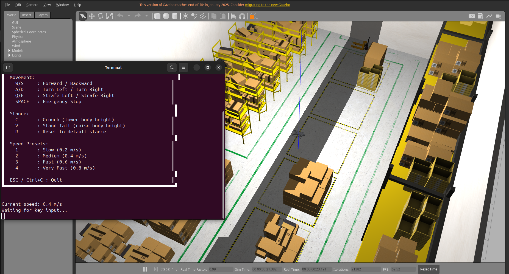
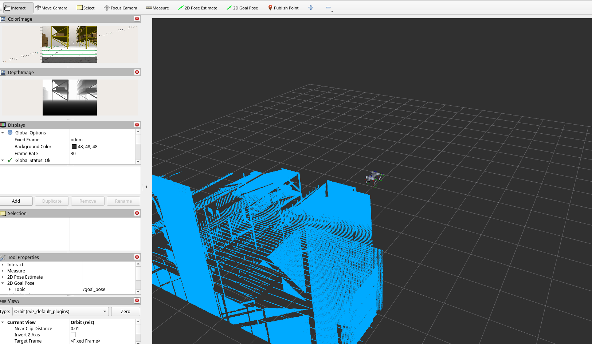

# 3D LiDAR ROS2 Legged Robot Inspection

**A complete ROS2 Humble simulation for the Unitree Go2 robot featuring SLAM, LiDAR, Depth Camera, and a Factory Warehouse Environment.**



## Overview

This project provides a robust capabilities-based simulation for quadruped inspection robots. It integrates:
- **Unitree Go2 Robot** (using CHAMP controller)
- **AWS RoboMaker Small Warehouse** (realistic industrial environment)
- **Advanced Sensors**: 3D LiDAR (Velodyne) & RGB-D Camera (Simulated RealSense)
- **Mapping**: `slam_toolbox` for real-time 2D mapping
- **Control**: Custom WASD keyboard controller with height/stance adjustment

## Prerequisites

- **OS**: Ubuntu 22.04 or 24.04 (Linux)
- **Package Manager**: [Micromamba](https://mamba.readthedocs.io/en/latest/installation/micromamba-installation.html) (recommended) or Conda
- **ROS2 Distro**: Humble Hawksbill

## Installation

### 1. Clone the Repository
```bash
git clone https://github.com/adeirman46/Dangerous-Industrial-Inspection-Robot-3D-Lidar-and-Depth-Camera.git
cd Dangerous-Industrial-Inspection-Robot-3D-Lidar-and-Depth-Camera
# (Or cd ~/3dlidar_ros2_legged_robot_inspection if locally renamed)
```

### 2. Create the Environment
We use `micromamba` to manage ROS2 dependencies cleanly on any Linux system.

```bash
# Create environment named 'ros2_env' with ROS2 Humble and Gazebo
micromamba create -n ros2_env -c conda-forge -c robostack-staging \
    ros-humble-desktop \
    ros-humble-gazebo-ros-pkgs \
    ros-humble-gazebo-ros2-control \
    ros-humble-xacro \
    ros-humble-robot-localization \
    ros-humble-ros2-controllers \
    ros-humble-ros2-control \
    ros-humble-velodyne \
    ros-humble-velodyne-gazebo-plugins \
    ros-humble-velodyne-description \
    ros-humble-slam-toolbox \
    ros-humble-nav2-bringup \
    ros-humble-teleop-twist-keyboard \
    python=3.10
```

### 3. Build the Workspace
Activate the environment and build. **Note:** We exclude the ROS1-based warehouse world package from the build, but use its assets directly.

```bash
micromamba activate ros2_env
colcon build --cmake-args -DPython_EXECUTABLE=$CONDA_PREFIX/bin/python3
```

*Note: If `aws_robomaker_small_warehouse_world` fails to build, ignore it. It is already marked to be ignored by `colcon` in this repo.*

### 4. Source the Setup
```bash
source install/setup.bash
```

## 🚀 Quick Run (Recommended)

I have provided a one-click script to setup the environment and launch the demo:

```bash
./launch_demo.sh
```

This will:
1.  Activate `ros2_env`
2.  Launch Gazebo with the Warehouse World
3.  Spawn the Go2 Robot
4.  Launch the **WASD Controller** in a new terminal

## Manual Usage

If you prefer to run manually:

**Terminal 1: Main Simulation**
```bash
micromamba activate ros2_env
source install/setup.bash
ros2 launch go2_bringup full_demo.launch.py
```

## Controls (WASD)

A separate terminal will open for control. **Examples:**

| Key | Action |
|-----|--------|
| **W / S** | Move Forward / Backward |
| **A / D** | Turn Left / Right |
| **Q / E** | Strafe Left / Right (Slide) |
| **Space** | **Emergency Stop** |
| **C / V** | Adjust Height (Crouch / Stand) |
| **R** | Reset Stance |
| **1 - 4** | Change Speed (Slow -> Fast) |

## Sensor Topics

Detailed sensor data is available for inspection algorithms:

*   **LiDAR**: `/velodyne_points` (3D PointCloud2), `/scan` (2D LaserScan)
*   **Depth Camera**: `/depth_camera/depth/image_raw`, `/depth_camera/depth/points`
*   **RGB Camera**: `/depth_camera/color/image_raw`
*   **Odometry**: `/odom`

## 🗺️ SLAM and Camera Visualization

To visualize the robot's sensors and real-time SLAM mapping, run the SLAM visualization script **after** the main demo is running:

**Terminal 1: Main Simulation**
```bash
./launch_demo.sh
```

**Terminal 2: SLAM & Camera Visualization**
```bash
./launch_slam_camera.sh
```

This will open RViz2 displaying:
- **3D LiDAR Point Cloud** (green) - Velodyne VLP-16
- **2D Laser Scan** (red) - converted from 3D point cloud for SLAM
- **Depth Camera Point Cloud** (cyan) - Intel RealSense style depth camera
- **Color and Depth Images** - live camera feeds
- **SLAM Map** - real-time 2D occupancy grid map

Move the robot using WASD controls to build a map of the warehouse environment!


